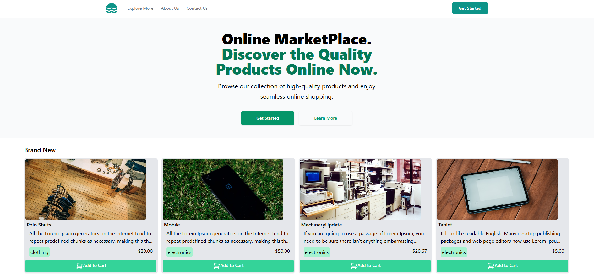
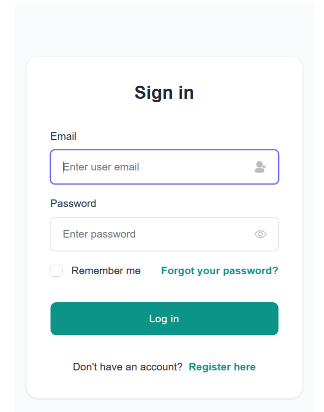
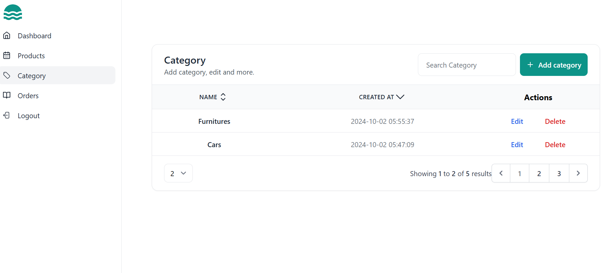

# Tall Stack Ecommerce

The TALL Stack E-commerce App is a simple and minimal web application for online shopping. It allows users to create an account, save items to their cart, view product details with quantities, and proceed to the payment page effortlessly. Built on the powerful TALL stack, it provides a smooth user experience and is ideal for learning or building a basic e-commerce solution. Users can easily manage their shopping journey with an intuitive interface. 

After cloning the project into your directory, follow the given commands for the its working.

### Prerequisites
- PHP ^8.2.0
- Composer
- Laravel 11
- Livewire 3
- Node.js & npm

## Technologies Used

- **Backend**: Laravel
- **Frontend**: Tailwind CSS, Blade (template engine), Alpine.js
- **JavaScript**: Node.js, npm
- **Build Tools**: (Vite)
- **Database**: MySQL
- **Version Control**: Git
- **Others**: Daisy UI (HeroIcons and Flowbite).

## Screenshots

 

 

# Navigate into the project directory:
cd your-repo

# Install Composer:
composer install

# Create a .env file:
cp .env.example .env

# Generate an application key:
php artisan key:generate

# Create database MySQl named tall_stack_ecommerce:

# Run migrations:
php artisan migrate

# Setup Storage Link:
php artisan storage:link

# Generate Node dependencies
npm install

# Run the command for assets compiling
npm run dev

# On New Terminal Start the local development server:
php artisan serve
